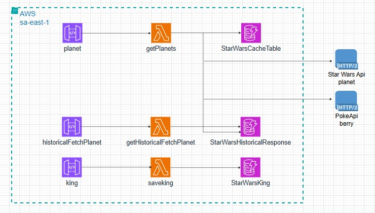

# Servicio

starwars-planets-backend-service

## Descripción

### getPlanets

Api que integra dos apis:

- Star Wars Api servicio planets
- PokeApi servicio berry

Se hace la integración considerando que el berry (comida tipica del planeta) contiene el mismo id del planeta.

Se consulta si hay datos del id en cache, si hay se retornan y se guarda en la BD en el histórico
Sino hay datos en cache, se consultan las apis, se guarda en caché e histórico

En ambos casos el resultado se retorna al cliente http

### getHistoricalFetchPlanet

Servicio que retorna las consultas guardadas en la BD

### saveKing

Servicio que permite guardar registros en la BD

## Endpoints desarrollados

Se desarrollaron 3 endpoints

- planet: de donde se obtiene el planeta
- king: se almacena el rey de un planeta
- historicalFetchPlanet: brinda el historico de las consultas a planet, páginado con el último registro brindado (este campo es retornado por el api, cuando se consulta el primero no debe de enviarse)

## Diagrama de Arquitectura

## Consideraciones:

- Para evitar cobros de AWS, para el caché se utilizó una BD de dynamo con ttl para auto eliminación (pocos segundos para demostrar la auto eliminación)
- En el archivo serverless se creó un solo rol para las tres lambdas, para simplicidad

## Contrato:

http://swagger-docs-starwars-victorzubiaga.s3-website-sa-east-1.amazonaws.com/#/

## Pruebas funcionales

En el repositorio está la colección de postman, archivo:
Softesk Test.postman_collection.json
